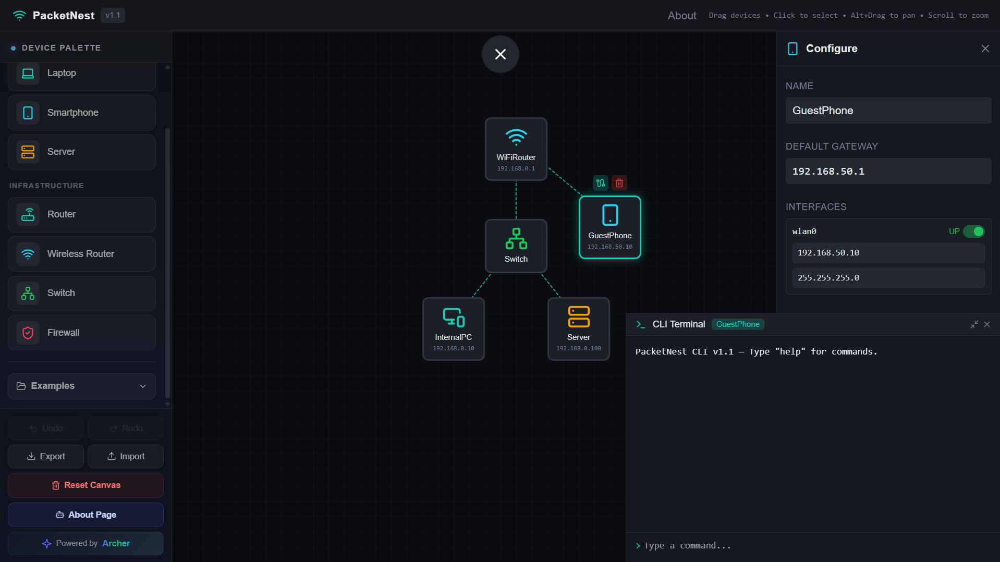
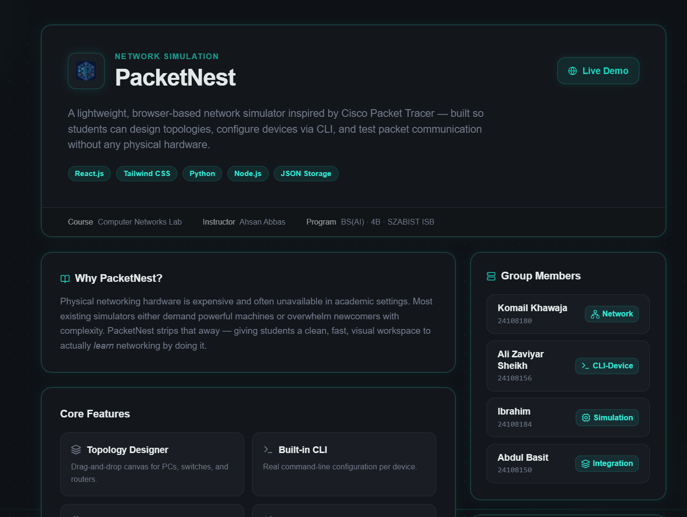

<div align="center">



<br/><br/>

# `PacketNest`

### <span style="color:#3DDC97">▍</span> NETWORK SIMULATION — SIGNAL BLUEPRINT

A lightweight, browser-based network simulator inspired by Cisco Packet Tracer — built so students can design topologies, configure devices via CLI, and test packet communication without any physical hardware.

<br/>

[](https://packetnest.vercel.app/)

<br/>


</div>

<br/>

```
┌──────────────────────────────────────────────────────────────┐
│  root@packetnest:~$ status                                     │
│  > canvas ......... ONLINE                                     │
│  > cli-engine ...... READY                                     │
│  > simulation ...... ACTIVE                                    │
└──────────────────────────────────────────────────────────────┘
```

## ▍ Overview

**PacketNest** is a lightweight, browser-based network simulator inspired by Cisco Packet Tracer — built so students can design topologies, configure devices via CLI, and test packet communication without any physical hardware.

<br/>

## ▍ Why PacketNest?

> Physical networking hardware is expensive and often unavailable in academic settings. Most existing simulators either demand powerful machines or overwhelm newcomers with complexity.
>
> **PacketNest strips that away** — a clean, fast, visual workspace to actually learn networking by doing it.

---

## ▍ Core Features

<table>
<tr>
<td width="50%" valign="top">

### 🖱️ `Topology Designer`

Drag-and-drop canvas for PCs, switches, and routers.

</td>
<td width="50%" valign="top">

### 💻 `Built-in CLI`

Real command-line configuration per device.

</td>
</tr>
<tr>
<td width="50%" valign="top">

### 📡 `Packet Simulation`

Test connectivity and observe packet delivery live.

</td>
<td width="50%" valign="top">

### 💾 `Save & Load`

Export and import topologies as JSON.

</td>
</tr>
</table>

<br/>

<div align="center">

<br/>
<sub><b>Fig. 2</b> — CLI configuration & live packet simulation</sub>
</div>

---

## ▍ Objectives

|  #   | Objective                                            |
| :--: | ---------------------------------------------------- |
| `01` | Graphical simulation environment for educational use |
| `02` | Drag-and-drop topology design and device management  |
| `03` | Simulate PC, switch, and router communication        |
| `04` | Built-in CLI for real command-based configuration    |
| `05` | Save, load, and manage topologies efficiently        |

---

## ▍ Tech Stack

| Layer                | Technology     |
| -------------------- | -------------- |
| 🔵 UI Framework      | `React.js`     |
| 🔷 Styling           | `Tailwind CSS` |
| 🟡 Simulation Logic  | `Python`       |
| 🟢 Runtime / Tooling | `Node.js`      |
| 🟣 Persistence       | `JSON Storage` |

---

## ▍ Getting Started

```bash
# clone
git clone https://github.com/<your-org>/PacketNest.git
cd PacketNest

# install
npm install

# run
npm run dev
```

> App runs at `localhost:5173` by default.

---

## ▍ Group Members

---

## ▍ Course Info

|                |                                    |
| -------------- | ---------------------------------- |
| **Course**     | Computer Networks Lab              |
| **Developer**  | Abdul Basit                        |
| **Program**    | BS(AI) · 4B · SZABIST ISB          |
| **Department** | Robotics & Artificial Intelligence |

---

## ▍ Links

`→` [**Return to Simulator**](https://packetnest.vercel.app/)
`→` [**packetnest.vercel.app**](https://packetnest.vercel.app/)

<br/>

<div align="center">

━━━━━━━━━━━━━━━━━━━━━━━━━━━━━━━━━━━

<sub><i>Department of Robotics & Artificial Intelligence</i></sub>
<br/>
<sub><i>SZABIST University, Islamabad</i></sub>

</div>
